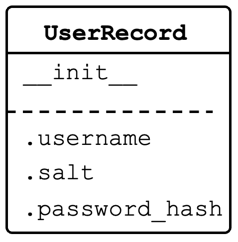
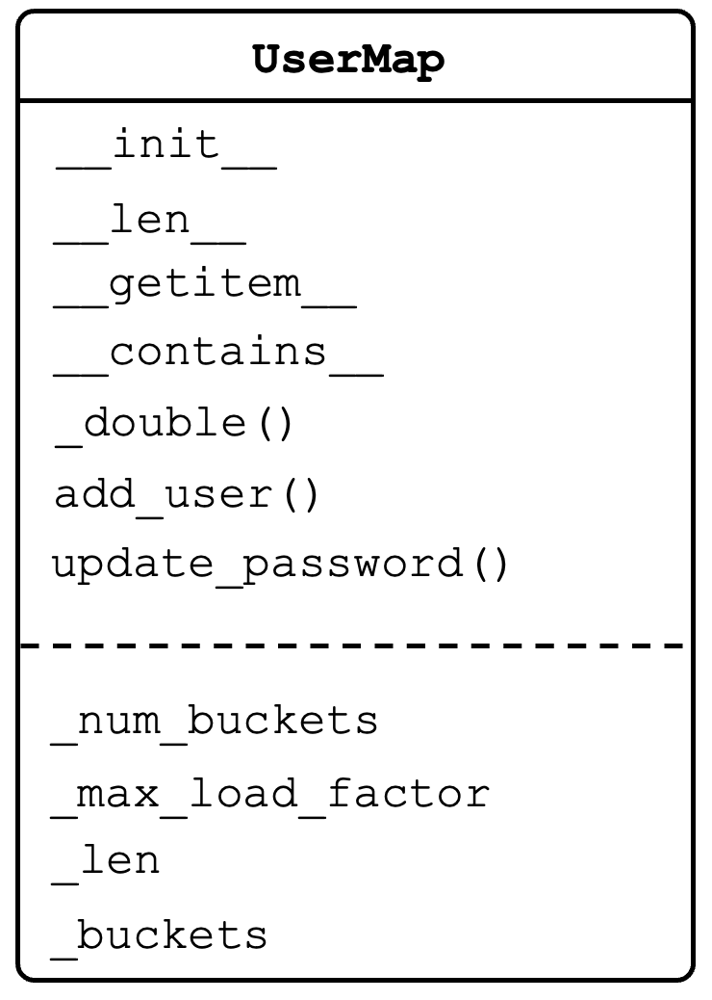

# Module 8 Homework - User Database

## Overview

In this homework, we are going to implement a user database for an application. The database will hold a record for each user to be used for logging into the application via a username and password combination.

**NOTE: Do not use the built-in set or dictionary types in this assignment - you must implement the functionality yourself**.

### User Record Creation

When a new user registers with the database, they will provide an initial username and password combination. A user record will be created for them and the given username will be stored in plain text as a string within the record. However, we will not do the same for the password.

### Password Hashing

Since passwords are extremely sensitive information, it is extremely bad practice to store them in plain text inside the user record. If the database is leaked, the user's passwords are also directly leaked. 

A somewhat better practice is to store the hash of the password inside the user record. Since secure hashes are extremely difficult to efficiently invert, the passwords are not directly accessible from the leak. However, if users have chosen a weak password, the leaked database of password hashes can still be used to reverse engineer the passwords (e.g., using a [rainbow table attack](https://capec.mitre.org/data/definitions/55.html)).
A much better practice is to _salt_ the given password (augmenting it with additional entropy) and then only store the hash of the _salted password_. 

### Salted Password Hashing

A **salt** is a random string of characters that is concatenated with the user's password before hashing. It is created when a user record is initialized. In this assignment, we will be creating random salts of 8 characters using the `random` and `string` modules. An example of creating a salt, salted password, and hash of a salted password using these modules is shown below.

```python
>>> import random
>>> import string
>>> pw = "cse2050"
>>> salt = "".join(random.choices(string.ascii_letters + string.digits, 
                                  k=8))
>>> saltedpw = salt + pw
>>> saltedpw_hash = hash(saltedpw) 
```

### Updating Passwords

When a user wants to update their password, they must provide their current password to verify their identity. Since the salt is saved to the user record, we can created a salted version of given password and then hash that. If the computed hash matches the hash in the user's record, then the given password is correct and the user is verified. Then, using a new, freshly generated salt, the new password is salted and hashed. The new hash overwrites the old hash, completing the password update process.

## Part 1 - `class UserRecord`

Each user registered in the database will have an associated record object. The `UserRecord` class must support the following attributes:

* `username`
    * The username used to log into the application (type: `string`).
* `salt`
    * The random salt string created for the user upon initialization (type: `string`).
* `password_hash`
    * The hash of the salted password (type: `int`).


<div style="text-align: center;">
    
</div>


## Part 2 - `class UserMap`

Write a data structure `UserMap` that allows `O(1)` (on average) updating of a user records whenever a new user is added or a user wants to update their password. The keys should be the `username` strings and the values should be the associated `UserRecord` objects.
The `UserMap` class must support the following methods and attributes:

* `__len__`
    * Returns the number of records stored in the database.

* `__getitem__`
   * Returns the stored user recored for a given username.
   * Raises `KeyError` if a record for the given username is not in the database.

* `__contains__`
    * Returns `True` (`False`) if a given username is (is not) registered in the database.
    
* `add_user(username, password)`
    * Adds a user record to the database using the given username and password.
    * This method should utilize [**linear probing**](https://en.wikipedia.org/wiki/Linear_probing) to find the appropriate internal storage location for the user record.
    * If the username is already registered in the database, this method should raise a `RuntimeError`.

* `update_password(username, current_password, new_password)`
    * Updates the user's password if and only if the supplied `current_password` is correct.
    * Updates user record with a fresh salt before creating new salted password hash.
    * If `username` is not registered in the database, raises `KeyError`.
    * If `current_password` is incorrect, raises a `PasswordError` (this is a custom error class that is defined in the starter code).

* `_double()`
    * Private method that is used to double the size of internal storage within the database when the number of records exceeds 75% (starter code already contains `self._max_load_factor` equal to 0.75) of the available storage locations (buckets). After increasing storage, all records in the database are rehashed.

Your class should support `O(1)` running times and `O(n)` memory allocation for the above methods on average, regardless of how many users are added (with the exception of `_double`, which should have `O(n)` running time).

<div style="text-align: center;">
    
</div>

## Examples

These examples are intended to be illustrative, not exhaustive. Your code may have bugs even if it behaves as below. Write your own unittests to test all expected behaviors.

```python
>>> from UserMap import UserMap
>>> um = UserMap()
>>> um.add_user("user1", "cse2050")
>>> "user1" in um
True
>>> "user2" in um
False
>>> um.update_password("user1", "cse2050", "lovelace")
>>> um.update_password("user1", "notlovelace", "hopper")
Traceback (most recent call last):
...
usermap.PasswordError: incorrect password.
```
```python
>>> from UserMap import UserMap
>>> um = UserMap()
>>> um.add_user("user1", "cse2050")
>>> record = um["user1"]
>>> record.username
'user1'
>>> record.salt
'oBCPmYXX'
>>> record.password_hash
-2463802647202830252
>>> hash(record.salt + "lovelace")
2461245473721689958
>>> hash(record.salt + "cse2050")
-2463802647202830252
```

## Imports

No imports are allowed on the assignments, with the following exceptions:

* `random` - used to generate salts. May also be used for testing.
* `string` - used to generate salts.  May also be used for testing.
* `typing` - not required, but some students have requested it.

## Submission

At a minimum, submit the following files with the specified classes:

* `usermap.py`
   * `class UserRecord`
   * `class UserMap`

* `testusermap.py`
   * Include unittests for `class UserMap` behavior.

You should include tests for the entire public interface. 

Please note this assignment is 100% manually graded.

Students must submit **individually** by the due date (typically Tuesday at 11:59 pm EST) to receive credit.
