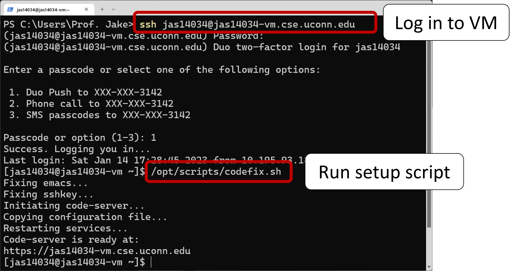
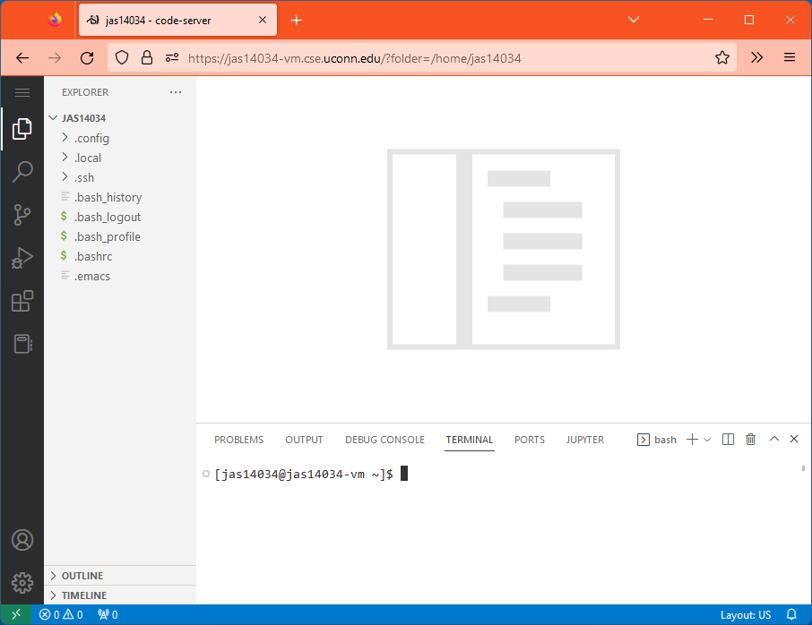

# CSE Virtual Machines

You'll have a virtual machine (VM) this semester. If you are off campus, you will need to VPN in through Cisco Anyconnect ([instructions](https://kb.uconn.edu/space/IKB/10907091023/Cisco+AnyConnect+VPN)) to access your VM.

## Setup

You need to run a setup script the first time you connect to your VM:

* Open a terminal
    * [Mac](https://support.apple.com/guide/terminal/open-or-quit-terminal-apd5265185d-f365-44cb-8b09-71a064a42125/mac): `cmd `+ `space`, type *terminal*, `return`
    * [Windows](https://support.kaspersky.com/common/windows/14637#block0): `windows key`, type *cmd*, `enter`

* ssh in to `netID@netID-vm.cse.uconn.edu` and log in with your netID password + 2fa
    * Common issues:
        * Password isn't working - verify that you have the same password for all UConn services at [netid.uconn.edu](https://netid.uconn.edu) by running the Password Test under the **My NetID** dropdown menu
        * Infinite 2fa prompts - make sure you are selecting an option (1, 2, or 3) at the prompt, not just pressing "enter"

* Run `/opt/scripts/codefix.sh`

## Working with your VM

You can always ssh in to your VM and work from terminal - vim, emacs, and nano are all avaiable to your for writing code.

Alternatively, you can open a browser and go to `netID-vm.cse.uconn.edu` (see image below). This will serve you an instance of code-server, a VS Code fork designed to be accessed remotely.

## Backing up files

Sometimes things go wrong - never depend on a single copy of a critical file (like a homework, for instance). Backup your files whenever you finish working:

* If you are in terminal, you can use `scp` to transfer files between the remote VM and your local machine.

* If you are using the code-server interface, you can right click on a file to download it locally.