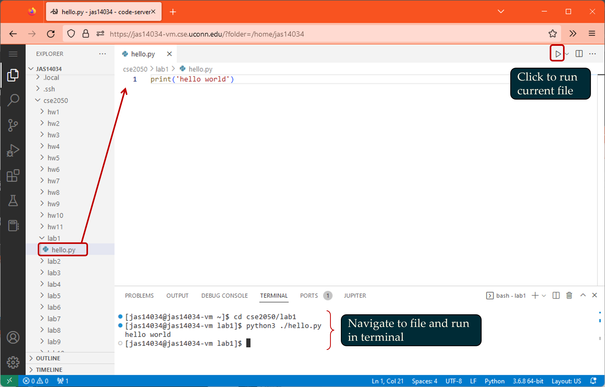

# Code server

Code server is a fork of VS code designed for remote coding - point a browser to your VM by typing `NETID-vm.cse.uconn.edu` in the address bar, and you'll see something that looks a lot like VS Code:


We'll start by setting up a nice directory structure, then we'll create and run our first file.

##	Setup - Initial Directories

We'll want to open up a terminal to create files and folders. Click the hamburger menu in the top left (the three stacked lines), then select **Terminal > New Terminal**, and a new terminal should open.

Next, we'll create some folders to keep our code organized. The `EXPLORER` sidebar on the left shows our present working directory (pwd), which should be called `netID` (`jas14034` in the example shown). You can check the `pwd` of your terminal with the command `pwd`:

```bash
[jas14034@jas14034-vm ~]$ pwd
/home/jas14034
```

Create a directory for this course with `mkdir`, then move into it with the change directory command `cd`:

```bash
[jas14034@jas14034-vm ~]$ mkdir cse2050
[jas14034@jas14034-vm ~]$ cd cse2050/
[jas14034@jas14034-vm cse2050]$ 
```

Next, make a few directories for your programming assignments. The example below creates directories for 11 labs and 11 homeworks:

```bash
[jas14034@jas14034-vm cse2050]$ mkdir lab{1..11} # make lab1, lab2, .., lab11 folders
[jas14034@jas14034-vm cse2050]$ ls # list directories
lab1  lab10  lab11  lab2  lab3  lab4  lab5  lab6  lab7  lab8  lab9
[jas14034@jas14034-vm cse2050]$ mkdir hw{1..11} # make hw1, hw2, .., hw11 folders
```

Now, move into the lab1 directory using the `cd` command, then create a file to edit using `touch`.

```bash
[jas14034@jas14034-vm cse2050]$ cd lab1
[jas14034@jas14034-vm lab1]$ touch hello.py
[jas14034@jas14034-vm lab1]$ ls
hello.py
```

At this point, my file hierarchy looks something like the following tree (you can see a graphical representation of this in the `EXPLORER` tab on VS Code):

```
jas14034
 `-- cse2050
     |-- hw1
     |-- hw2
     .. (8 lines truncated)
     |-- hw11
     |-- lab1
     |   `-- hello.py
     |-- lab2
     .. (8 lines truncated)
     |-- lab11

```

## Install Python Extension

Next, click on the *Extensions* icon on the left-hand sidebar in code-server and install the extension `python` by `ms-python`.

## Create and run a file

You can start edtitting `hello.py` in a few ways. Clicking the file in the `EXPLORER` tab should open it for editting on the top half of your screen. If you'd rather work entirely in terminal, you have access to `vim` and `emacs` in this VM. 

When you're ready to run your code, you can do so in the terminal with `python3 file.py`, or just click the triangle in the top right (see figure below).

Add a print statement to your code and run it now. However you run it, you should see the output in a terminal.

